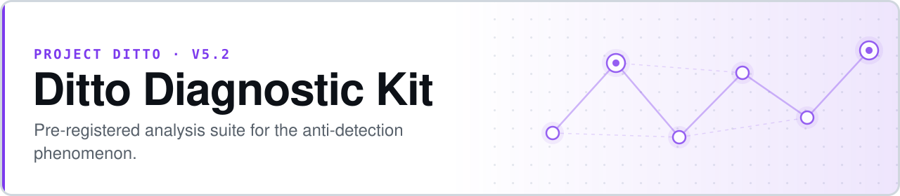

<p align="center">
  <picture>
    <source media="(prefers-color-scheme: dark)" srcset="assets/banner-dark.svg">
    
  </picture>
</p>

# Ditto Diagnostic Kit v0.1

**A panel of 22 models failed to detect what one model detected. This kit is the post-mortem.**

The Ditto Diagnostic Kit (DDK) is a pre-registered analysis suite for [v5.1](https://github.com/safiqsindha/Ditto-5.1)'s results. Its job is narrow and deliberate: work out the **mechanism** behind the anti-detection phenomenon — models answering "violation" almost regardless of the chain — rather than collecting more evidence that it exists.

- **Two tiers, cheapest first** — Tier 0 re-analyses existing v5.1 data for free; Tier 1 spends only where Tier 0 leaves a question open
- **The pre-registration outranks the code** — if a script disagrees with the pre-reg, the script is the bug
- **Human judgement is scheduled, not incidental** — authors write an interim memo between tiers, before Tier 1 is designed
- **Hard budget cap** — $150 for Tier 1, tracked live in a committed ledger


**[Pre-registration](prereg/DDK_v0.1_PREREG.md)** · **[Budget ledger](budget_tracker.csv)** · **[v5.1 results](https://github.com/safiqsindha/Ditto-5.1)**

```bash
pip install -r requirements.txt
python tier0/tier0_pipeline.py      # free — re-analysis of existing v5.1 data
pytest tests/
```

| | |
|---|---|
| **Program** | Project Ditto |
| **Authors** | Safiq Sindha · Myriam Sindha |
| **Created** | 2026-05-03 |

## Execution order

The order is the method. Tier 1 is not designed until the authors have written up what Tier 0 showed, which prevents the diagnostics from being steered by a result the team was hoping for.

| # | Step | Cost |
|---|---|---|
| 1 | Sign the pre-registration — [`prereg/DDK_v0.1_PREREG.md`](prereg/DDK_v0.1_PREREG.md), both authors | — |
| 2 | Run Tier 0 — `python tier0/tier0_pipeline.py` | free |
| 3 | Authors write the interim memo — `synthesis/interim_memo_post_tier0.md` | — |
| 4 | Run Tier 1 — `python tier1/tier1_pipeline.py` | ~$55–95 |
| 5 | Authors write the synthesis — `synthesis/synthesis_v0.1.md` | — |

## Layout

```
prereg/          signed pre-registration and decision log — read-only after sign-off
data/            input corpora (contents gitignored; .gitkeep markers only)
tier0/           Tier 0 scripts — free re-analysis of v5.1 data
tier0_outputs/   Tier 0 tables, plots, summaries
tier1/           Tier 1 scripts — cheap targeted diagnostics
tier1_outputs/   Tier 1 outputs
synthesis/       human-authored memos and synthesis documents
utils/           shared utilities: data loading, budget tracking, scoring
tests/           unit tests for every analysis script
```

## Ground rules

- [`prereg/DDK_v0.1_PREREG.md`](prereg/DDK_v0.1_PREREG.md) is the authoritative specification. Analysis scripts must match it exactly — **if a script deviates, fix the script, not the pre-reg.**
- `prereg/` is read-only after sign-off.
- Tier 1 has a hard cap of **$150**; see [`budget_tracker.csv`](budget_tracker.csv) for live spend.
- Every analysis script carries unit tests in `tests/`.

## The Ditto program

| Version | Domain | Headline |
|---|---|---|
| [v1](https://github.com/safiqsindha/Project-Ditto) | Pokémon Showdown telemetry | Sonnet +0.206 · Haiku +0.066 |
| [v2](https://github.com/safiqsindha/Project-Ditto-v2) | Programming agent trajectories | Partial reproduction |
| [v3](https://github.com/safiqsindha/Project-Ditto-V3) | Chess · Chess960 · checkers · draughts | Phase 1 complete, paused at Gate 8 |
| [v4](https://github.com/safiqsindha/Project-Ditto-V4) | Pokémon, as a methodology control | +0.131, strong-positive |
| [v4.5](https://github.com/safiqsindha/Ditto-V4.5--DeepSeek-Flash-test) | DeepSeek V4 Flash cross-model probe | Scoping stub |
| [v5](https://github.com/safiqsindha/Ditto-V5) | PUBG · NBA · CS:GO · Rocket League · poker | 4-tier hierarchy, closed |
| [v5.1](https://github.com/safiqsindha/Ditto-5.1) | 22-model cross-provider panel | Near-chance across the panel |
| **v5.2** ⟵ *you are here* | **Diagnostic kit for the v5.1 null** | **Pre-registered, in progress** |
| [v5.4](https://github.com/safiqsindha/DITTO-V5.4-OLAT) | 24 inference levers, two DeepSeek models | 6 meaningful conditions |

## License

No license file is present in this repository. Research artifacts; contact the repository owner for use beyond academic citation.
